# STRAMPESO — Entity Relationship Diagram

Generated from the Mongoose schemas in [server/models/](../server/models/). This is a NoSQL
(MongoDB) database, so "relationships" below are modeled with `ObjectId` references (`ref: "..."`)
rather than foreign keys enforced by the database itself.

## Entities

| Entity | Model file | Purpose |
|---|---|---|
| User | [User.js](../server/models/User.js) | Single collection for all account types (resident/jobseeker, employer, admin, superadmin) |
| JobseekerProfile | [JobseekerProfile.js](../server/models/JobseekerProfile.js) | Extended NSRP-style profile data for a resident, 1:1 with User |
| EmployerProfile | [EmployerProfile.js](../server/models/EmployerProfile.js) | Extended business/registration data for an employer, 1:1 with User |
| JobVacancy | [JobVacancy.js](../server/models/JobVacancy.js) | A job posting created by an employer |
| JobApplication | [JobApplication.js](../server/models/JobApplication.js) | A resident's application to a JobVacancy |
| QualificationTemplate | [QualificationTemplate.js](../server/models/QualificationTemplate.js) | Employer-owned reusable qualification sets for postings |
| Conversation | [Conversation.js](../server/models/Conversation.js) | A messaging thread between two or more Users |
| Message | [Message.js](../server/models/Message.js) | A single chat message inside a Conversation |
| Follow | [Follow.js](../server/models/Follow.js) | A User following another User (employer follows, etc.) |
| JobLike | [JobLike.js](../server/models/JobLike.js) | A User liking/saving a JobVacancy |
| Announcement | [Announcement.js](../server/models/Announcement.js) | Admin-authored news/SPES posts |
| NewsLike | [NewsLike.js](../server/models/NewsLike.js) | A User liking an Announcement |
| NewsComment | [NewsComment.js](../server/models/NewsComment.js) | A User's comment on an Announcement |
| SpesApplication | [SpesApplication.js](../server/models/SpesApplication.js) | A resident's application to a SPES Announcement program |
| Notification | [Notification.js](../server/models/Notification.js) | In-app notification sent to a User, optionally from an actor User |
| Appeal | [Appeal.js](../server/models/Appeal.js) | A suspended/banned User's appeal for admin review |
| Report | [Report.js](../server/models/Report.js) | A User's report of a policy violation against some target |
| AuditLog | [AuditLog.js](../server/models/AuditLog.js) | Immutable log of admin/system actions, optionally against a target User |

## Mermaid ER Diagram

```mermaid
erDiagram
    USER ||--o| JOBSEEKER_PROFILE : "has"
    USER ||--o| EMPLOYER_PROFILE : "has"
    USER ||--o{ JOBVACANCY : "posts (employer)"
    USER ||--o{ JOBAPPLICATION : "submits (applicant)"
    JOBVACANCY ||--o{ JOBAPPLICATION : "receives"
    USER ||--o{ QUALIFICATION_TEMPLATE : "owns (employer)"
    USER }o--o{ CONVERSATION : "participates in"
    CONVERSATION ||--o{ MESSAGE : "contains"
    USER ||--o{ MESSAGE : "sends"
    USER ||--o{ FOLLOW : "follows (follower)"
    USER ||--o{ FOLLOW : "is followed (following)"
    USER ||--o{ JOBLIKE : "likes"
    JOBVACANCY ||--o{ JOBLIKE : "liked by"
    USER ||--o{ ANNOUNCEMENT : "authors"
    USER ||--o{ NEWSLIKE : "likes"
    ANNOUNCEMENT ||--o{ NEWSLIKE : "liked by"
    USER ||--o{ NEWSCOMMENT : "writes"
    ANNOUNCEMENT ||--o{ NEWSCOMMENT : "has"
    USER ||--o{ SPESAPPLICATION : "applies (applicant)"
    ANNOUNCEMENT ||--o{ SPESAPPLICATION : "receives (SPES posts)"
    USER ||--o{ NOTIFICATION : "receives"
    USER ||--o{ NOTIFICATION : "triggers (actor)"
    USER ||--o{ APPEAL : "files"
    USER ||--o{ REPORT : "files (reporter)"
    USER ||--o{ REPORT : "is target of (targetOwner)"
    USER ||--o{ AUDITLOG : "performs (actor)"
    USER ||--o{ AUDITLOG : "is target of"
    USER ||--o{ USER : "provisions / reviews / suspends"

    USER {
        ObjectId _id PK
        string name
        string email UK
        string password
        string googleId
        string role "resident, employer, admin, superadmin"
        string accountStatus "active, suspended, banned"
        string verificationStatus
        ObjectId createdBySuperadmin FK
        ObjectId verificationReviewedBy FK
        ObjectId suspendedBy FK
        string companyName
        string companySize
        date createdAt
    }

    JOBSEEKER_PROFILE {
        ObjectId _id PK
        ObjectId userId FK "unique, -> User"
        string civilStatus
        string employmentStatus
        string[] skills
        string[] preferredIndustries
        object[] workHistory
        object[] eligibilities
    }

    EMPLOYER_PROFILE {
        ObjectId _id PK
        ObjectId userId FK "unique, -> User"
        string tradeName
        string officeType
        object employerClassification
        string totalWorkforceSize
        object businessAddress
    }

    JOBVACANCY {
        ObjectId _id PK
        string title
        string description
        string location
        ObjectId employer FK "-> User"
        string status "active, closed, draft"
        object[] qualifications
        string industry
        string workNature
        boolean archived
    }

    JOBAPPLICATION {
        ObjectId _id PK
        ObjectId applicant FK "-> User"
        ObjectId vacancy FK "-> JobVacancy"
        string status
        date appliedAt
        object interview
    }

    QUALIFICATION_TEMPLATE {
        ObjectId _id PK
        ObjectId employer FK "-> User"
        string name
        string jobTitle
        object[] items
    }

    CONVERSATION {
        ObjectId _id PK
        ObjectId[] participants FK "-> User"
        string lastMessage
        date lastMessageAt
    }

    MESSAGE {
        ObjectId _id PK
        ObjectId conversationId FK "-> Conversation"
        ObjectId sender FK "-> User"
        string content
        boolean isRead
    }

    FOLLOW {
        ObjectId _id PK
        ObjectId follower FK "-> User"
        ObjectId following FK "-> User"
    }

    JOBLIKE {
        ObjectId _id PK
        ObjectId userId FK "-> User"
        ObjectId jobId FK "-> JobVacancy"
    }

    ANNOUNCEMENT {
        ObjectId _id PK
        string title
        string content
        string category "general, hiring, training, event, advisory, spes"
        ObjectId author FK "-> User"
        object spes
        boolean isActive
    }

    NEWSLIKE {
        ObjectId _id PK
        ObjectId userId FK "-> User"
        ObjectId newsId FK "-> Announcement"
    }

    NEWSCOMMENT {
        ObjectId _id PK
        ObjectId newsId FK "-> Announcement"
        ObjectId author FK "-> User"
        string content
        boolean isHidden
    }

    SPESAPPLICATION {
        ObjectId _id PK
        ObjectId applicant FK "-> User"
        ObjectId announcement FK "-> Announcement"
        string status
        object evaluation
        object result
    }

    NOTIFICATION {
        ObjectId _id PK
        ObjectId recipient FK "-> User"
        ObjectId actor FK "-> User"
        string type
        string relatedEntityType
        ObjectId relatedEntityId
        boolean isRead
    }

    APPEAL {
        ObjectId _id PK
        ObjectId user FK "-> User"
        string accountStatus
        string status "pending, under_review, approved, denied"
        ObjectId reviewedBy FK "-> User"
    }

    REPORT {
        ObjectId _id PK
        ObjectId reporter FK "-> User"
        string targetType
        string targetId "polymorphic, not a real FK"
        ObjectId targetOwner FK "-> User"
        string category
        string status
        object resolution
    }

    AUDITLOG {
        ObjectId _id PK
        ObjectId actorId FK "-> User"
        string actorRole
        string action
        ObjectId targetUserId FK "-> User"
        string targetType
        string targetId "polymorphic, not a real FK"
        string severity
    }
```



## Relationship notes

- **User is the hub.** Almost every other collection references `User` at least once (author,
  actor, applicant, employer, reporter, etc.). Several fields are self-referencing FKs back to
  `User`: `createdBySuperadmin`, `verificationReviewedBy`, `suspendedBy` on `User` itself, plus
  `reviewedBy` on `Appeal`, `resolution.handledBy` on `Report`, `scheduledBy` on
  `JobApplication.interview`, and `evaluatedBy`/`decidedBy` on `SpesApplication`.
- **User ↔ JobseekerProfile / EmployerProfile** are 1:1 extension tables (unique index on
  `userId`), splitting rarely-needed detail fields off the core `User` document instead of
  embedding everything.
- **JobVacancy ↔ JobApplication** is the core hiring pipeline (1 job : many applications).
- **Report** and **AuditLog** use a **polymorphic reference**: `targetType` + `targetId` (a plain
  string, not an ObjectId ref) can point at a `User`, `JobVacancy`, `NewsComment`, `Announcement`,
  or `Message` depending on `targetType`. This is not enforceable as a real foreign key in
  MongoDB/Mongoose and is resolved manually in the controller.
- **Conversation ↔ User** is many-to-many via the `participants` array; `Message` then belongs to
  exactly one `Conversation` and one `sender` User.
- **Follow**, **JobLike**, **NewsLike** are all join/junction-style documents with a
  compound-unique index (e.g. `{ follower, following }`, `{ userId, jobId }`) to prevent
  duplicates — the closest Mongo equivalent of a relational many-to-many join table.

## Prompt to (re)generate this ERD

Use this prompt with an LLM (pointed at the repo) or paste the relevant schema files as context if
the tool doesn't have repo access:

> Scan the Mongoose model files under `server/models/*.js` in this repository. For each schema,
> extract: the model/collection name, every field with its type, whether it's required/unique,
> enum values if present, and every field that is an `ObjectId` with a `ref` (or an array of
> them) — these are the foreign-key relationships. Then produce:
> 1. An Entity-Relationship Diagram in Mermaid `erDiagram` syntax, with one block per model listing
>    its key fields (mark the `_id` as PK and every `ref` field as FK, noting the referenced
>    collection), and relationship lines between entities using the correct cardinality
>    (`||--o{` for one-to-many, `}o--o{` for many-to-many array refs like `participants`, `||--o|`
>    for 1:1 extension profiles tied by a unique-indexed foreign key).
> 2. A short table summarizing what each entity represents.
> 3. A "Relationship notes" section calling out anything unusual: self-referencing foreign keys,
>    polymorphic references (a string `targetType`/`targetId` pair instead of a typed `ref`),
>    join/junction collections enforced via compound unique indexes, and 1:1 profile-extension
>    collections.
> Output everything as a single Markdown file with the Mermaid diagram in a fenced ` ```mermaid `
> code block so it renders directly on GitHub.

## Recommended ERD generator website

For turning this into a polished, click-to-edit diagram (rather than just the Mermaid text
render), **[dbdiagram.io](https://dbdiagram.io)** is the best fit here:

- It has a simple DSL (DBML) that's very close to what's above — you can paste the entity/field
  list and get a clean drag-and-drop ER diagram in seconds.
- Free tier is generous enough for a project this size (18 entities).
- One-click export to PNG/SVG/PDF, and it can also *reverse-engineer* a diagram if you ever export
  a real SQL schema — useful if this project's data model is ever moved to a relational database.
- Since this project is MongoDB (schemaless), dbdiagram.io won't connect to the DB directly — feed
  it the Mermaid/field list above manually, or ask an LLM to convert the Mermaid block into DBML.

Alternative if you specifically want to keep everything in Mermaid (e.g. to stay renderable
natively on GitHub/GitLab without an external account): **[mermaid.live](https://mermaid.live)**
is the official live editor — paste the code block above straight in to tweak and export it.
