# STRAM-PESO Current Implemented-System DFD

This document is grounded in the code that exists in the repo today, especially the route mounts in [server/server.js](server/server.js), the route modules under [server/routes](server/routes), and the Mongoose collections in [server/models](server/models).

It intentionally does not describe the manual LMD-PESO Appendix H workflow or the earlier proposed design represented in the legacy DFD package. The current system includes the modules now implemented in the MERN app: auth/profile, job posting/search, job applications, recommendations, follows, job likes, messaging, notifications, news/announcements with likes and comments, SPES applications, reports, appeals, verification, admin/superadmin oversight, and audit logging.

## Data store legend used below

- D1 — User
- D2 — JobVacancy
- D3 — JobApplication
- D4 — SpesApplication
- D5 — Announcement
- D6 — Conversation
- D7 — Message
- D8 — Notification
- D9 — Follow
- D10 — JobLike
- D11 — NewsLike
- D12 — NewsComment
- D13 — Report
- D14 — Appeal
- D15 — AuditLog
- D16 — QualificationTemplate
- D17 — JobseekerProfile
- D18 — EmployerProfile
- D19 — JobseekerDocument

## 1) Context Diagram

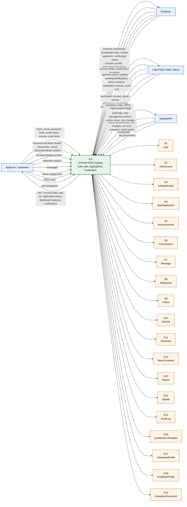

## 2) Level 0 Diagram

```mermaid
flowchart LR
    A["Applicant / Jobseeker"]
    E["Employer"]
    L["LMD-PESO Staff / Admin"]
    S["Superadmin"]

    P1["1.0<br/>Identity & Profile Management<br/>Register, sign in, update profile, verify employer, manage resume/cover-letter library"]
    P2["2.0<br/>Job Marketplace<br/>Browse, post, edit, feature, close jobs"]
    P3["3.0<br/>Application Handling<br/>Apply to jobs, track status, shortlist, hire"]
    P4["4.0<br/>Recommendation & Social Engagement<br/>Hybrid job search, follows, job likes"]
    P5["5.0<br/>Messaging & Notification Flow<br/>Create conversation, send message, unread count"]
    P6["6.0<br/>News & Announcement Flow<br/>Publish, comment, like, view updates"]
    P7["7.0<br/>SPES Program Lifecycle<br/>Apply, evaluate, release results"]
    P8["8.0<br/>Moderation & Compliance<br/>Reports, appeals, verification reviews"]
    P9["9.0<br/>Admin / Superadmin Oversight<br/>Role changes, audit log review, admin provisioning"]

    D1["D1<br/>User"]
    D2["D2<br/>JobVacancy"]
    D3["D3<br/>JobApplication"]
    D4["D4<br/>SpesApplication"]
    D5["D5<br/>Announcement"]
    D6["D6<br/>Conversation"]
    D7["D7<br/>Message"]
    D8["D8<br/>Notification"]
    D9["D9<br/>Follow"]
    D10["D10<br/>JobLike"]
    D11["D11<br/>NewsLike"]
    D12["D12<br/>NewsComment"]
    D13["D13<br/>Report"]
    D14["D14<br/>Appeal"]
    D15["D15<br/>AuditLog"]
    D16["D16<br/>QualificationTemplate"]
    D17["D17<br/>JobseekerProfile"]
    D18["D18<br/>EmployerProfile"]
    D19["D19<br/>JobseekerDocument"]

    A -->|"email, password, profile data, resume, cover letter, SPES application"| P1
    A -->|"resume/cover-letter library: builder-generated or uploaded document, set primary, delete"| P1
    A -->|"browse jobs, apply, follow, like, message"| P2
    A -->|"job application payload (resume/cover-letter file or saved library documentId), status check"| P3
    A -->|"job preferences, follow target, like action"| P4
    A -->|"message text, conversation IDs, inbox request"| P5
    A -->|"news article view, comment, like"| P6
    A -->|"SPES application, docs, applicant details"| P7
    A -->|"report submission, appeal request"| P8

    E -->|"company details, job posting, qualification templates, applicant review"| P2
    E -->|"application decision, shortlist, hire"| P3
    E -->|"job posting metrics, ranked candidates"| P4
    E -->|"message to applicant, inbox operations"| P5
    E -->|"announcement read, profile exposure"| P6
    E -->|"employer verification documents"| P1

    L -->|"staff verification queue, admin actions, announcement publishing"| P1
    L -->|"job review, feature toggle, vacancy status"| P2
    L -->|"application triage, SPES evaluation"| P3
    L -->|"admin moderation list, queue review"| P8
    L -->|"SPES evaluation & result release"| P7
    L -->|"news posting, moderation"| P6

    S -->|"admin provisioning, account activation, role management, audit review"| P9
    S -->|"superadmin moderation"| P8
    S -->|"job governance / admin job deletion"| P2

    P1 --> D1
    P1 --> D17
    P1 --> D18
    P1 --> D19
    P2 --> D2
    P2 --> D16
    P3 --> D3
    P3 --> D2
    P3 --> D19
    P4 --> D9
    P4 --> D10
    P4 --> D1
    P4 --> D2
    P5 --> D6
    P5 --> D7
    P5 --> D8
    P6 --> D5
    P6 --> D11
    P6 --> D12
    P7 --> D4
    P7 --> D5
    P8 --> D13
    P8 --> D14
    P8 --> D15
    P9 --> D1
    P9 --> D15

    classDef actor fill:#e8f0fe,stroke:#1a73e8,stroke-width:1.5px,color:#111;
    classDef process fill:#e6f4ea,stroke:#137333,stroke-width:2px,color:#111;
    classDef store fill:#fff4e5,stroke:#b06000,stroke-width:2px,stroke-dasharray:6 4,color:#111;
    class A,E,L,S actor;
    class P1,P2,P3,P4,P5,P6,P7,P8,P9 process;
    class D1,D2,D3,D4,D5,D6,D7,D8,D9,D10,D11,D12,D13,D14,D15,D16,D17,D18,D19 store;
```

## 3) Level 1 Exploded Diagrams

### 3.1 Process 1.0 — Identity, profile, and verification

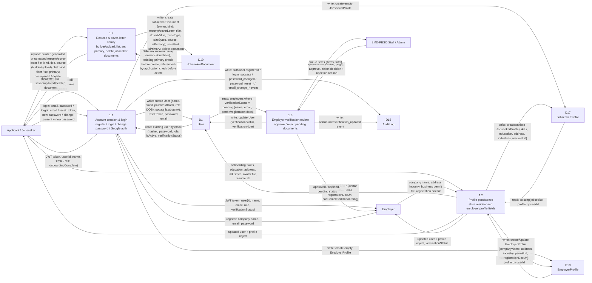

### 3.2 Process 2.0 — Job marketplace management

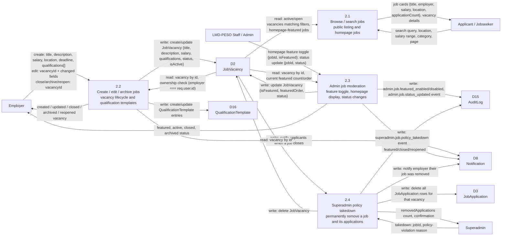

### 3.3 Process 3.0 — Job applications and status handling

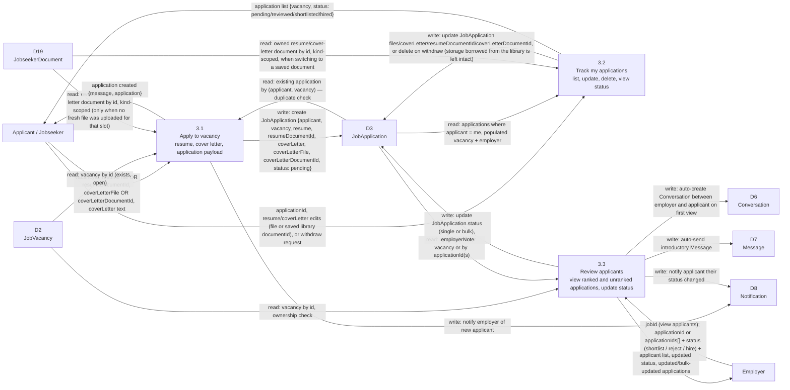

### 3.4 Process 4.0 — Recommendation and social engagement

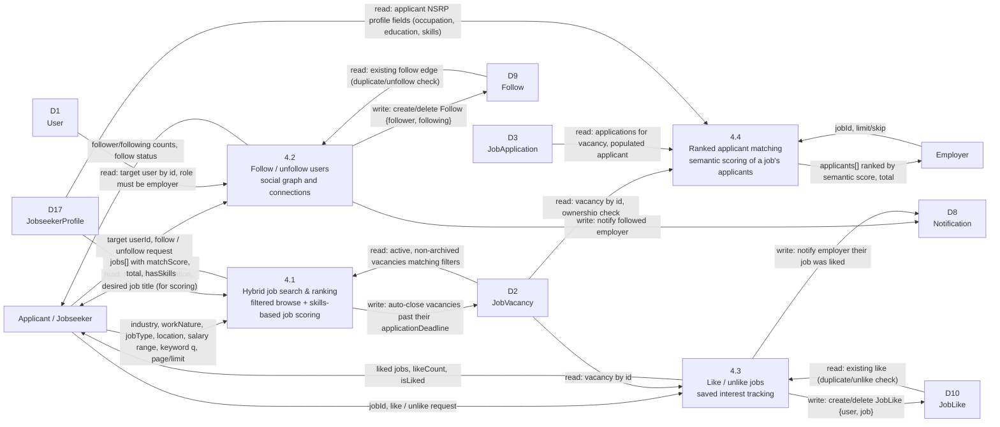

### 3.5 Process 5.0 — Messaging and notifications

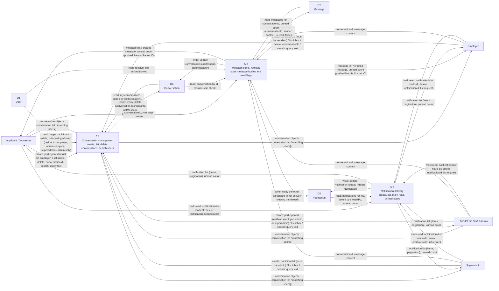

### 3.6 Process 6.0 — News and announcements

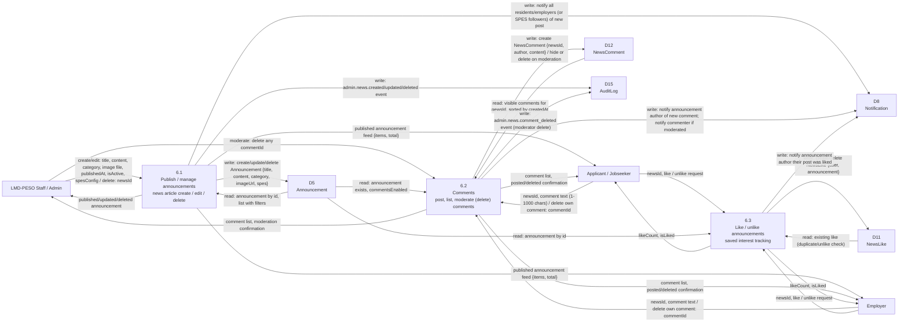

### 3.7 Process 7.0 — SPES application lifecycle

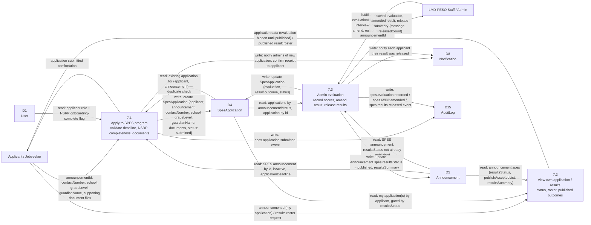

### 3.8 Process 8.0 — Moderation, compliance, and appeals

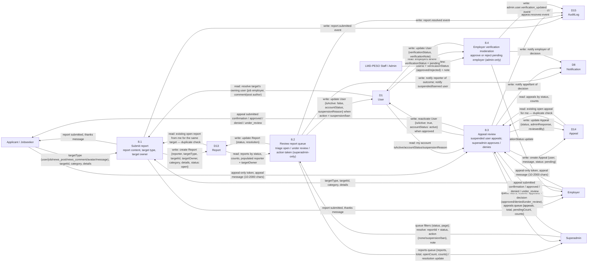

### 3.9 Process 9.0 — Admin and superadmin oversight

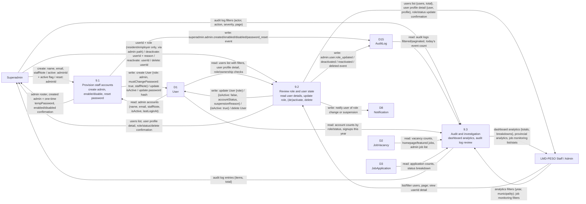

## 4) Current code-grounded notes: what is now out of date

The legacy documentation package in [README_DFD.md](README_DFD.md) is no longer aligned with the implemented system in the repo. It describes an older proposed design and references a smaller set of processes than what is actually present in the current codebase.

The repo now contains additional implemented modules that are not represented in the earlier design, including:

- SPES program management — [server/routes/spesRoutes.js](server/routes/spesRoutes.js)
- appeals and suspension review — [server/routes/appealRoutes.js](server/routes/appealRoutes.js)
- reports and moderation — [server/routes/reportRoutes.js](server/routes/reportRoutes.js)
- admin/superadmin oversight + audit logs — [server/routes/adminRoutes.js](server/routes/adminRoutes.js), [server/routes/superadminRoutes.js](server/routes/superadminRoutes.js)
- messaging and conversations — [server/routes/messageRoutes.js](server/routes/messageRoutes.js)
- notifications — [server/routes/notificationRoutes.js](server/routes/notificationRoutes.js)
- news announcements + comments + likes — [server/routes/newsRoutes.js](server/routes/newsRoutes.js), [server/routes/newsCommentRoutes.js](server/routes/newsCommentRoutes.js), [server/routes/newsLikeRoutes.js](server/routes/newsLikeRoutes.js)
- job likes and follows — [server/routes/jobLikeRoutes.js](server/routes/jobLikeRoutes.js), [server/routes/followRoutes.js](server/routes/followRoutes.js)
- recommendation flow — [server/routes/recommendationRoutes.js](server/routes/recommendationRoutes.js)
- verification queue — [server/routes/verificationRoutes.js](server/routes/verificationRoutes.js)
- jobseeker resume/cover-letter document library — [server/routes/jobseekerDocumentRoutes.js](server/routes/jobseekerDocumentRoutes.js), [server/controllers/jobseekerDocumentController.js](server/controllers/jobseekerDocumentController.js)

Their corresponding models are present in [server/models](server/models), including [server/models/SpesApplication.js](server/models/SpesApplication.js), [server/models/Appeal.js](server/models/Appeal.js), [server/models/Report.js](server/models/Report.js), [server/models/AuditLog.js](server/models/AuditLog.js), [server/models/Conversation.js](server/models/Conversation.js), [server/models/Message.js](server/models/Message.js), [server/models/Notification.js](server/models/Notification.js), [server/models/Announcement.js](server/models/Announcement.js), [server/models/JobLike.js](server/models/JobLike.js), [server/models/Follow.js](server/models/Follow.js), [server/models/NewsComment.js](server/models/NewsComment.js), and [server/models/JobseekerDocument.js](server/models/JobseekerDocument.js) (D19).

The resume/cover-letter builder is implemented client-side in [client/src/pages/ResumeStudio.jsx](client/src/pages/ResumeStudio.jsx) (template selection, section editing, PDF rendering via [client/src/utils/exportUtils.js](client/src/utils/exportUtils.js)) and [client/src/components/coverLetterBuilder.jsx](client/src/components/coverLetterBuilder.jsx) / [client/src/utils/coverLetterTemplates.js](client/src/utils/coverLetterTemplates.js); it has no dedicated server process of its own. A built document only touches the backend when the jobseeker saves it, at which point it is rendered to a PDF blob and posted through the same `/jobseeker/documents/upload` endpoint used for plain uploads (`source: "builder"` vs `"upload"` distinguishes the two, per [server/models/JobseekerDocument.js](server/models/JobseekerDocument.js)). The saved library is managed via [client/src/components/JobseekerDocumentsPanel.jsx](client/src/components/JobseekerDocumentsPanel.jsx) (surfaced on the jobseeker's profile page) and consumed at apply-time by [client/src/components/ApplyModal.jsx](client/src/components/ApplyModal.jsx), which lets an applicant pick a saved `resumeDocumentId`/`coverLetterDocumentId` instead of uploading a fresh file — this is process 1.4 in section 3.1 and the corresponding D19 reads added to process 3.0 in section 3.3.

The earlier DFD package therefore should be treated as legacy documentation, not as the current implemented-system DFD for this repo.

Section 3's exploded diagrams also fold in the employer-scoped surface at [server/routes/employerRoutes.js](server/routes/employerRoutes.js) / [server/controllers/employerController.js](server/controllers/employerController.js) — a parallel job-CRUD, applicant-review (`updateApplicationStatus`, `bulkUpdateApplicationStatuses`), qualification-template, and employer-stats API that duplicates part of `jobRoutes.js` under an `/employer` prefix and was not previously represented in this document. Every data-store arrow in section 3 was re-derived directly from each controller's Mongoose calls and `res.json(...)` payloads (including the shared `logAuditEvent` / `createNotificationForUser` / `notifyManyUsers` / `notifyLike` service calls), so a process now shows both what it reads from a store before acting and what it writes back, not just an unlabeled link.
